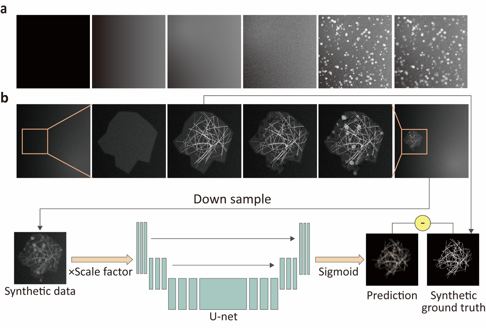
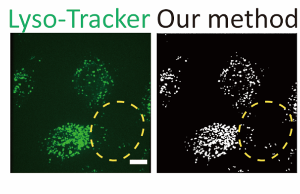
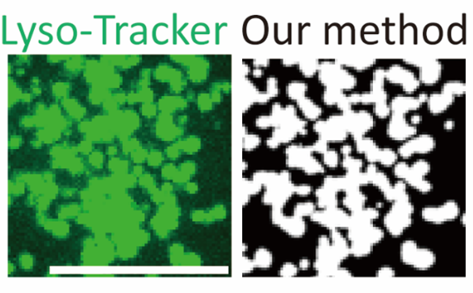
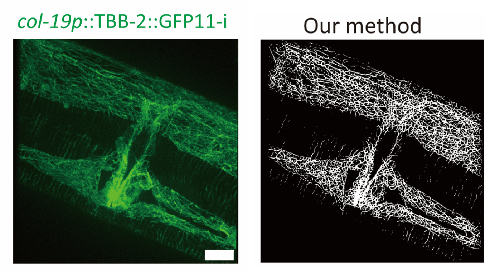

# SynSeg: Cytoskeleton and Vesicle Segmentation with Generated Datasets and U-Net

**SynSeg** is a novel pipeline that leverages biologically inspired synthetic datasets for training U-Net architectures to segment subcellular structures, including **microtubules** and **vesicles**. Our method eliminates the reliance on experimental or physics-based simulation data, simplifying the dataset creation process while maintaining biological relevance. With just **1,000 synthetic images** and **five epochs**, **SynSeg** achieves impressive segmentation performance, all without fine-tuning on experimental microscopy data.

## Requirements

To run SynSeg, you'll need the following Python packages:

- **Pytorch** == 2.5.1
- **Scikit-learn** == 1.6.0
- **Scipy** == 1.14.1
- **opencv-python** == 4.10.0.84
- **numpy** == 2.2.0

We recommend installing all the packages via the following command:

```bash
pip install ultralytics
```
Ultralytics is a highly documented YOLO package that includes almost everything needed for computer vision deep learning tasks.
### Overview
SynSeg utilizes U-Net, a deep learning architecture designed for image segmentation, in combination with synthetically 
generated datasets. By creating biologically inspired synthetic images, we remove the need for large, manually annotated
experimental data. The pipeline trains a U-Net model for the segmentation of important cellular structures without 
fine-tuning on experimental data.

Our approach is based on the idea that synthetic data can provide high-quality, relevant information for training deep 
learning models, which is particularly useful when real-world data is scarce or difficult to obtain.


### Performance
After training on 1,000 synthetic images for five epochs, the model is capable of segmenting subcellular structures such
as microtubules and vesicles, as shown in the results below.





## Scripts
### Data Generation

To generate training and validation datasets, use the following scripts:
- **Vesicle Generation**: `Vesicle_generator.py`
- **Cytoskeleton Generation**: `Cytoskeleton_generator.py`

### Segmentation
- **Vesicle Segmentation**: `SynSeg_Vesicle.py`
    - **Input**: 16-bit TIFF images with a single channel.
    - **Output**: Synthetic vesicle dataset for training.
  
- **Cytoskeleton Segmentation**: `SynSeg_Cytoskeleton.py`
    - **Input**: 8-bit TIFF images with a single channel.
    - **Output**: Synthetic cytoskeleton dataset for training.

These scripts will take your TIFF images and output binary masks. The threshold for mask generation can be adjusted 
directly within the script to suit your needs.


